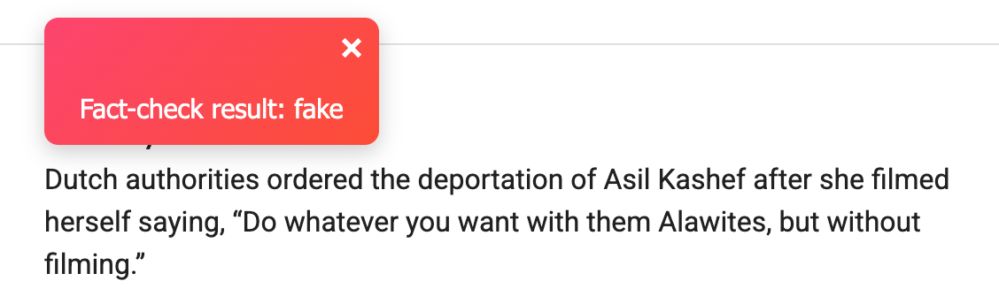
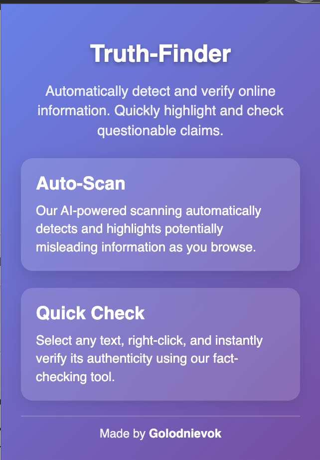

# Truth-Finder

Truth-Finder is a Chrome extension that empowers you to quickly verify the accuracy of online information. In today’s fast-paced digital world, distinguishing between reliable and misleading content is more important than ever. Truth-Finder automatically scans web pages for questionable claims using the Google Fact-Check Tools API and displays dynamic, in-page notifications to help you decide what to trust.

> **Note:**  
> While Truth-Finder leverages fact-check reviews from reputable sources, the reliability of the displayed results depends on the data available in the API. There might be occasional discrepancies, so use the tool as a helpful guide rather than an absolute verdict.

## Features

- **Automatic Scanning:**  
  The extension continuously scans web pages and highlights sections that may contain misinformation.

- **Manual Fact-Check:**  
  Simply highlight any text, right-click, and choose **"Check selected text for fakeness"** to trigger an instant fact-check.

- **Dynamic In-Page Notifications:**  
  - **Red Notification:** Indicates potentially false or misleading content.
  - **Green Notification:** Indicates the content appears factual.
  - **Gray Notification:** Indicates no fact-check reviews were found.
  
- **User-Controlled Alerts:**  
  Notifications remain visible until manually dismissed, ensuring you never miss a critical alert.

## Installation

###
1. **download the zip file and unpack it**

2. **Load the Extension in Chrome:**
   - Open Chrome and go to `chrome://extensions`.
   - Enable **Developer mode**.
   - Click **Load unpacked** and select the folder containing your extension files.
   - The extension will now be active in your browser.

## Usage

- **Auto-Scan:**  
  As you browse, Truth-Finder automatically scans the page for potentially misleading information and highlights it.

- **Manual Check:**  
  Highlight any text, right-click, and select **"Check selected text for fakeness"** to view an in-page notification with the fact-check result.

- **Notification Details:**  
  - **Red:** The selected text may contain false or misleading information.
  - **Green:** The selected text appears to be factual.
  - **Gray:** No fact-check reviews were found for the selected text.

## Screenshots

  
*Example notification showing a red alert for questionable content.*
  
*Example notification showing a green alert for verified content.*
  
*Example notification showing a grey alert for unknown content.*
  
*Example  showing a popup screen*

## Contributing

Contributions are welcome! To contribute:

1. Fork the repository.
2. Create a new branch for your feature or bug fix.
3. Commit your changes with clear messages.
4. Push to your branch and open a pull request.

## License

This project is licensed under the [MIT License](LICENSE).

## Contact

Made by [Golodnievok](https://t.me/golodnievokOF).  
For any questions or feedback, please open an issue or contact me directly.

---

